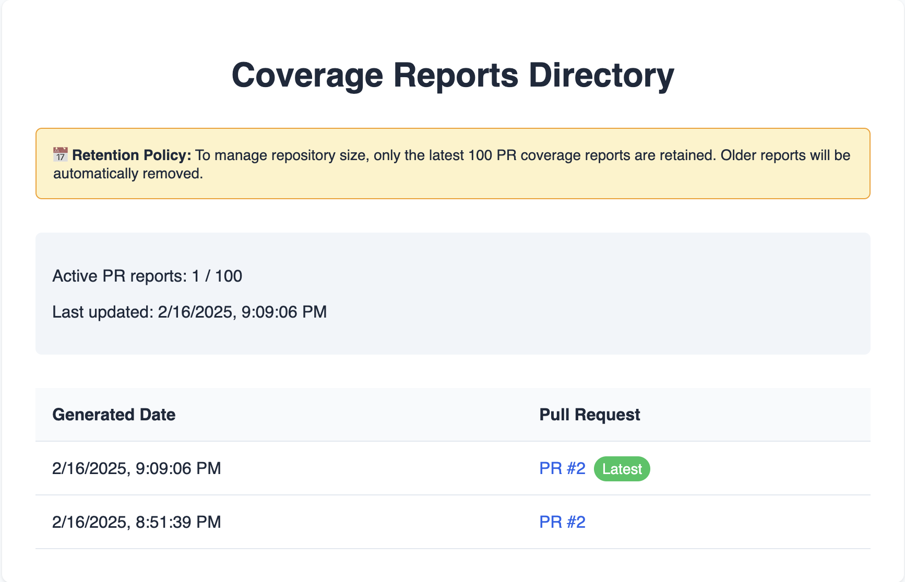
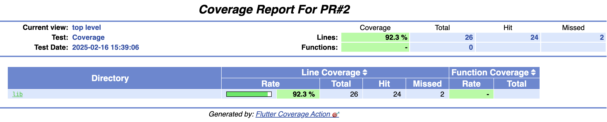
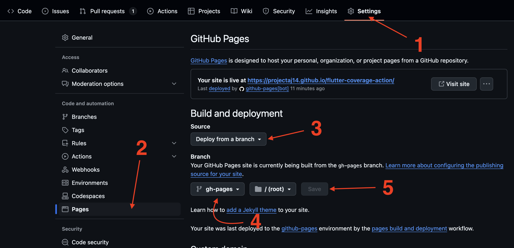

# flutter-coverage-action

[](https://github.com/ProjectAJ14/flutter-coverage-action/releases)
[](https://opensource.org/licenses/MIT)

📊 Reports Coverage to GitHub Pages with style! ⭐

Created by [Ajay Kumar]

## Demo
Check out the live demo: [Flutter Coverage Report](https://projectaj14.github.io/flutter-coverage-action/coverage/)





## Overview

This action generates a coverage report for your Flutter project and deploys it to GitHub Pages.
It is designed to work with Pull Requests only. You'll need to run tests with coverage enabled to use this action.
It generates the coverage report using the `lcov` format and uses the `genhtml` tool to generate the HTML report.

Once deployed, the coverage report will be available at `https://<username>.github.io/<repository>/coverage/index.html`.

## Setup

You'll need to set up GitHub Pages in your repository to host the coverage report:



## Usage

Add the following workflow to your repository:

```yaml
name: 📊 Reports Coverage

on:
  pull_request:      # 🤝 PR checks
    branches:
      - main         # 🎯 Target branch

jobs:
  reports-coverage:  
    runs-on: ubuntu-latest
    permissions:
      contents: write
      pull-requests: write
      pages: write
    steps:
      - name: 📦 Clone the Goodies
        uses: actions/checkout@v4
      - name: Set up Flutter
        uses: subosito/flutter-action@v2
        with:
          flutter-version: 3.19.6
      - name: Install dependencies
        run: flutter pub get
      - name: Run tests
        run: flutter test --coverage
        
      - name: 📊 Reports Coverage to Github Pages
        id: flutter-coverage-action
        uses:  ProjectAJ14/flutter-coverage-action@v1
        env:
          GITHUB_TOKEN: ${{ secrets.GITHUB_TOKEN }}
```

> Note: This action is designed to work with Pull Requests only. It will not work with other events.

## Inputs

| Input               | Description                                                         | Required | Default |
|---------------------|---------------------------------------------------------------------|----------|---------|
| `coverage_base_dir` | Base directory for coverage reports 📁                              | No       | `.`     |
| `max_reports`       | Maximum number of reports to retain 🔢                              | No       | `50`    |
| `debug_mode`        | Enable verbose logging for troubleshooting 🔍                       | No       | `0`     |
| `comment_on_pr`     | Whether to add a comment on the PR with the coverage report link 💬 | No       | `true`  |

## Related Documentation

- [Changelog](CHANGELOG.md)
- [License](LICENSE)

## Contributing

We welcome contributions in various forms:

- Proposing new features or enhancements
- Reporting and fixing bugs
- Engaging in discussions to help make decisions
- Improving documentation
- Sending Pull Requests

A big thank you to all our contributors! 🙌

<div align="center">
  <a href="https://github.com/ProjectAJ14/flutter-coverage-action/graphs/contributors">
    
  </a>
</div>

[Ajay Kumar]: https://github.com/ProjectAJ14